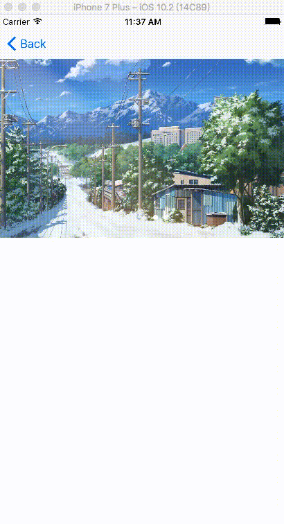

# SMCycleImageBanner
Cycle Banner Swift,support auto and manual scroll, and you can scroll it infinitely.


[](http://mit-license.org)




## Usage
Just drag 'SMCycleBannerView.swift' into your project.
###### using Autolayout (Storyboard)

Create a UIView in storyboard,then change the view class to "SMCycleBannerView", 
and connect it to your viewController.

```swift
@IBOutlet var m_cycleBannerView: SMCycleBannerView!

self.m_cycleBannerView.initCycleBanner()
self.m_cycleBannerView.configureTimeInterval(timeInterval: 2.0)
    
// if your images need loading, you can configure placeholder image.
self.m_cycleBannerView.configurePlaceholderImage(#imageLiteral(resourceName: "bg1.jpg"))

// import images and get callback of tap on image event.
self.m_cycleBannerView.configureImageViews(aryImages,autoScroll: true,didClickEventClosure: {(index) in
        print("select \(index)" )        
})
```
###### using Frame (programmatically)
```swift
// need to set it to "false"
self.automaticallyAdjustsScrollViewInsets = false
    
self.m_cycleBannerView = SMCycleBannerView(frame: 
CGRect(x: 0, y: 64, width: self.view.frame.size.width, height: 300))

self.view.addSubview(self.m_cycleBannerView)
    
self.m_cycleBannerView.initCycleBanner()

// import images and get callback of tap on image event.
self.m_cycleBannerView.configureImageViews(
    getImageList(),
    autoScroll: true,
    didClickEventClosure: {(index) in
        print("index : \(index)")
})

```
###### optional configure
```swift
// pageControl color
self.m_cycleBannerView.configurePageControlColor(indicatorTintColor: .white, currentPageIndicatorTintColor: .darkGray)
// autoScroll timeInterval.
self.m_cycleBannerView.configureTimeInterval(timeInterval: 8.0)

```

